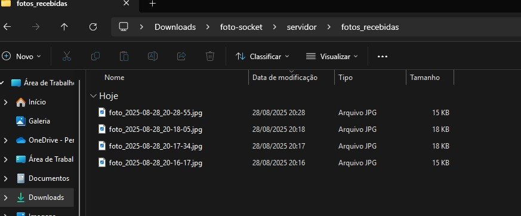

# Foto via Botão (Android → Servidor Python por Sockets)

Este projeto implementa a comunicação entre um **aplicativo Android** e
um **servidor Python** via **socket TCP**.\
O app captura uma foto e envia para o servidor, que a recebe, salva com
timestamp e exibe em uma janela.

------------------------------------------------------------------------

##  Demonstração (roteiro)

1.  Inicie o servidor Python.\
    A janela exibirá: **"Aguardando foto..."**

2.  No aplicativo Android, insira o **IP e porta** do servidor (se
    configurável).\
    Clique em **"Tirar e Enviar"**.

3.  O servidor salva e mostra a foto recebida.

4.  Envie outra foto → a janela será atualizada automaticamente.

------------------------------------------------------------------------

## Como executar o Servidor (Python)

### Pré-requisitos

-   Python 3.8+
-   Bibliotecas: `opencv-python`, `tkinter` (ou outra GUI disponível)

### Passos

``` bash
# Acesse a pasta do servidor
cd foto-socket/servidor

# Instale dependências
pip install opencv-python

# Inicie o servidor
python server.py
```

As imagens recebidas serão salvas em:

    foto-socket/servidor/fotos_recebidas

------------------------------------------------------------------------

## Como executar o App (Android)

### Pré-requisitos

-   Android Studio (ou SDK + Gradle)
-   Dispositivo físico ou emulador Android

### Passos

1.  Abra o projeto no **Android Studio**:

        FotoSocketApp/

2.  Conecte um celular ou inicie um emulador.

3.  Compile e rode o app:

    -   O app abrirá com um botão **"Tirar e Enviar"**.
    -   Ele utiliza **CameraX** para capturar a foto.
    -   A foto é enviada para o servidor no formato **JPEG (qualidade
        \~80, largura máx. 1280px)**.

------------------------------------------------------------------------

## Protocolo de Comunicação

A comunicação segue um protocolo simples via **TCP Socket**:

1.  O app envia **4 bytes** representando o tamanho da imagem.\
2.  Em seguida, envia os **bytes da foto (JPEG)**.\
3.  O servidor:
    -   Lê os 4 bytes iniciais → interpreta o tamanho.\
    -   Recebe os bytes da imagem.\
    -   Salva a imagem em disco com timestamp.\
    -   Exibe a última imagem recebida em uma janela (OpenCV/Tkinter).

------------------------------------------------------------------------

## Estrutura de Pastas

    ├── FotoSocketApp/           # Aplicativo Android (Kotlin)
    │   └── app/src/main/java/com/example/fotosocketapp/MainActivity.kt
    │
    └── foto-socket/
        └── servidor/
            ├── server.py        # Servidor Python
            └── fotos_recebidas/ # Fotos recebidas

------------------------------------------------------------------------

## Capturas de Tela

-   Tela do aplicativo Android com botão **"Tirar e Enviar"**\
	

-   Janela do servidor mostrando o recebimento das fotos
  
	

- Janela do servidor mostrando as fotos recebidas
  
	

------------------------------------------------------------------------

## Autores
-James Sousa
-Vanderle Carvalho
-David Natan
Projeto desenvolvido como parte da disciplina **Sistemas Distribuídos**,
Atividade 2.
